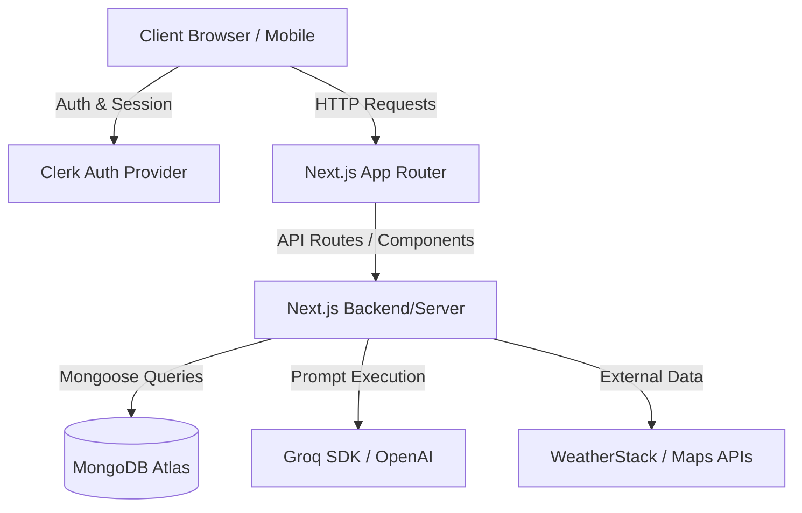

# Requirement and Design Document

## 1. Title & Metadata
**Project Name:** Odyssey - AI-Powered Travel Suite  
**Date & Version:** v1.0 (March 26, 2026)  
**Tech Stack Summary:** Next.js (App Router), MongoDB, Mongoose, Groq SDK, Clerk, Tailwind CSS.

## 2. Problem Statement & Goals

### The Gap
Modern travel planning is highly fragmented. Users typically juggle multiple applications for booking transport, creating itineraries, tracking expenses, and ensuring their safety in foreign locations. There is a distinct lack of cohesive, AI-driven platforms that personalize the entire travel lifecycle from end to end. Odyssey fills this gap by centralizing the travel experience into a single, intelligent hub.

### Functional Goals
*   **Generate Itineraries:** Leverage AI to dynamically build structured, highly personalized daily itineraries.
*   **Track Expenses:** Enable solo travelers and groups to track shared expenses, providing split summaries and net balances.
*   **SOS Beacon:** Provide a global, context-aware emergency beacon that surfaces country-specific numbers based on real-time location.

### Non-Functional Goals
*   **Low Latency for AI:** Optimize response times by utilizing fast models (e.g., Groq) and aggressive query caching.
*   **Mobile Responsiveness:** Ensure responsive fluid layouts specifically designed for travelers on the move via smartphones.
*   **Data Security:** Utilize Clerk for robust identity management and ensure user data is perfectly protected end-to-end.

## 3. System Architecture (The "Big Picture")

### Architecture Pattern: Full-Stack Serverless/Hybrid
Odyssey utilizes the **Next.js App Router** to implement a hybrid architecture:
*   **Server Components (RSC):** Used extensively for data fetching, SEO optimization, and securely performing database calls near the edge without exposing sensitive APIs to the client bundle.
*   **Client Components:** Strategically used at the leaf nodes of the component tree to provide highly interactive features like dynamic map rendering, interactive expense charts, and the Bento-Grid layout.

### Component Diagram

## 4. Detailed Data Design

### Database Schema
The database uses Mongoose to structure models securely. Key entities involve:
*   **User Config:** Maintained primarily via Clerk, with local references for application-specific preferences.
*   **Destination Schema:** Caches global locations with enriched, AI-generated metadata.
*   **Trip Schema:** Stores complex relations including `destinationId`, `startDate`, `endDate`, `budget`, team members, and the generated nested `itinerary` object.
*   **Expense Schema:** Tied strictly to an individual `Trip`, tracking the `payerId`, `splitBetween`, exact amount, and category.

### Data Flow Logic (Cache-Aside Strategy)
To ensure highly performant generation, Odyssey primarily uses a strict "Cache-Aside" AI enrichment strategy:
1.  **User Search:** The user searches for a destination (e.g., "Paris").
2.  **System Check:** The system queries the `Destinations` collection in MongoDB.
3.  **Found (Cache Hit):** If a rich profile exists locally, it serves it instantly.
4.  **Missing/Incomplete (Cache Miss):** If missing, the backend calls the AI provider (Groq/OpenAI) to generate and enrich the profile data.
5.  **Save & Serve:** The newly generated data is atomically saved to MongoDB and instantly served back to the user application.

## 5. API & Integration Design

### Internal APIs
Odyssey's backend is powered by Next.js serverless routes:
*   `/api/trips`: Handles the creation, dynamic updating, and fetching of user trips.
*   `/api/expenses`: Manages shared budget arrays, calculating splits and net offsets for team trips.
*   `/api/itinerary`: The AI processing wrapper that triggers generation flows and validates schemas.

### External APIs
*   **Authentication:** Clerk handles secure JWT generation and validation via Next.js Middleware.
*   **AI Generation:** Groq/OpenAI API keys are stored securely in `.env.local` and only executed server-side to prevent key leaks.
*   **Mapping & Routing:** Leaflet/React-Leaflet accesses localized tile mapping servers.

### Fault Tolerance
The system embraces graceful degradation. If an external API (like Groq) fails or times out, the backend wraps the call in a `try/catch` block and gracefully returns a placeholder profile or triggers a fallback UI message (e.g., "We're experiencing delays mapping this destination. Showing basic info."), ensuring the application never crashes for the user.

## 6. UI/UX Design Principles

### Design System
*   **Bento-Grid Layout:** Itineraries are specifically rendered in a modern Bento-Grid format. This breaks down complex chronological data (Morning, Afternoon, Evening) into highly scannable, visually digestible cards, keeping the traveler focused and un-overwhelmed.

### Mobile-First Approach
*   **Dashboard Feel:** Recognizing that travelers use mobile devices heavily at their destination, main action controls are redesigned into a clean 2x2 grid card interface. This prevents continuous scrolling and gives a professional, native app-like dashboard presentation.

### Accessibility
*   **One-Tap SOS Beacon:** The emergency beacon is a floating, high-contrast action button. One tap opens an overlay featuring direct `tel:` protocol links for Police, Fire, and Ambulance, uniquely parsed based on the user's detected country code.

## 7. Challenges & Concurrency Handling

### Race Conditions
A critical challenge in collaborative trip planning is handling concurrent edits. When two users add an expense to a shared trip simultaneously, a standard `save()` could overwrite data causing Mongoose `VersionError` failures. Odyssey solves this by utilizing Mongoose's `findByIdAndUpdate` combined with atomic operators (like `$push`), ensuring thread-safe data commits that stack sequentially.

### AI Formatting Constraints
Large Language Models frequently hallucinate formatting. To ensure the frontend always receives perfectly parseable JSON for the itinerary:
*   Strict system prompts dictate the exact schema required.
*   Generation calls are forced into standard JSON-mode where the AI provider allows.
*   The backend implements edge-cleaning to strip markdown code blocks and heavily validates the output structure before persisting to MongoDB.

## 8. Future Scalability (The "What's Next")

### Performance
*   **Redis Integration:** For frequently searched global hubs (e.g., London, Tokyo, New York), implementing in-memory Redis caching will be the next step to further drop geographical lookup latency well past the current MongoDB threshold.

### Analytics
*   **Deep Expense Dives:** Enhancing the Recharts integration to allow users to visualize their entire travel spending habits across a calendar year, categorized by flights, food, transport, and stays.
